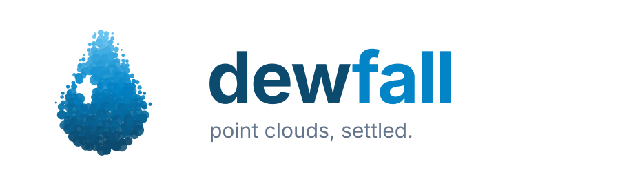

<p align="center">
  
</p>

# dewfall

**dewfall** is a point cloud management and rendering library. It converts arbitrary point cloud
input into a morton-ordered octree with level-of-detail, stored in a compressed, random-accessible
format (`.dew` files) that streams equally well from a local disk or an object store — and it ships
a graphics-API-agnostic renderer that draws those clouds at interactive rates on the desktop and in
the browser.

Named for the moment a cloud settles into points. Friends call it **dew**.

- **Live demo:** [dewfall.limilind.com](https://dewfall.limilind.com) — the WebGL2/WASM renderer
  streaming a dataset straight from S3.
- C++23 core, no RTTI, no exceptions. The public API is pure C (C99/C11 compatible), prefixed `dew_`.
- AGPL-3.0.

## Highlights

- **Converter pipeline** — streams arbitrary input (LAS/LAZ built in, or your own reader callbacks)
  through morton sorting, octree subdivision, leaf collapse, and bottom-up LOD generation, with a
  bounded memory budget and crash-safe checkpointing throughout.
- **The `.dew` format** — every node's attribute buffer is its own compressed blob. In an object
  store a dataset is one immutable object per blob, so every read is a whole-object GET: no range
  requests, CDN- and HTTP-cache-friendly, resumable uploads. Preprocessing (delta, decorrelation,
  byte shuffle) + zstd keep blobs small; a 200K-point node's xyz is typically well under 1 MB.
- **Cloud-native conversion** — convert with a destination bucket (`s3://`, `az://`) and finished
  subtrees upload incrementally while the conversion runs; the local cache file spills and evicts
  under a configurable cap.
- **Streaming renderer** — frustum-walked octree with pixel-error LOD selection, per-point LOD in
  the shader, crossfaded transitions, GPU and CPU memory budgets with a heap-pressure brake for
  mobile browsers, and render-time virtual subdivision of dense leaves.
- **Bring your own graphics API** — the renderer emits draw groups through callbacks; the repo
  includes a full OpenGL example and a WebGL2/Emscripten build with a React front end.

## Building

```bash
cmake --preset release
cmake --build cmake-build-release
```

| Target | What it is |
|---|---|
| `dew_converter` | converter library |
| `dew_render` | rendering library |
| `dew_common` | shared types |
| `dew` | the dewfall CLI — convert, inspect, copy, LAS/LAZ introspection (see below) |
| `renderer_example` | SDL/OpenGL viewer |
| `dew_render_wasm` / `dew_decode_worker` | browser renderer + decode-worker modules (Emscripten) |

Tests are doctest (`private_interface_unit_tests`, `public_interface_unit_tests`), on by default via
`DEW_BUILD_TESTS`.

## The `dew` CLI

One binary, five subcommands — this is the full-fledged converter and dataset toolbox:

```bash
dew convert input.laz -o output.dew        # convert (multiple inputs / wildcards work too)
dew convert *.laz -o s3://bucket/set \
    -C 'region=eu-north-1'                 # convert straight into a bucket: finished subtrees
                                           # upload incrementally while the conversion runs
dew info output.dew                        # compression / performance / cache statistics
dew info s3://bucket/set \
    -C 'region=eu-north-1;anonymous=true'  # ...works on cloud datasets too
dew extract output.dew --summary           # octree overview (--trees, --tree N, --node N:L:I)
dew extract output.dew xyz -n 10           # peek at attribute data (or extract it with -o)
dew copy output.dew s3://bucket/set        # copy/migrate a dataset (local <-> bucket)
dew laz input.laz                          # LAS/LAZ introspection: header + VLRs (--vlrs)
dew laz input.laz --points --offset 100000 -n 5   # ...or print/extract a point subrange (--csv)
```

`dew convert` knobs: `-c/--compression` (zstd default), `-n/--node-points` (blob-size lever),
`--cache`/`--cache-max-bytes` (local cache for a cloud destination). Run `dew help <command>`
for everything else.

## Driving the converter from code

The CLI is a thin client of the pure-C API — embed the same pipeline in your own tooling:

```c
struct dew_error_t *error = NULL;
struct dew_converter_t *converter = dew_converter_create(
    "output.dew", strlen("output.dew"), dew_open_file_semantics_truncate, &error);
struct dew_converter_str_buffer file = {"input.laz", strlen("input.laz")};
dew_converter_add_data_file(converter, &file, 1);
dew_converter_wait_idle(converter, &error);
dew_converter_destroy(converter);
```

LAS/LAZ input is built in; arbitrary sources plug in through
`dew_converter_set_file_converter_callbacks` (pre_init / init / convert_data callbacks that
stream your format's points into the provided buffers). Converting straight into a bucket is
one call — finished subtrees upload while the conversion runs:

```c
struct dew_converter_t *converter = dew_converter_create_with_destination(
    "cache.dew", strlen("cache.dew"),
    "s3://my-bucket/my-dataset", strlen("s3://my-bucket/my-dataset"),
    "region=eu-north-1", strlen("region=eu-north-1"),
    dew_open_file_semantics_truncate, &error);
```

Render it — the renderer knows nothing about your graphics API; you implement buffer callbacks and
dispatch the draw groups it emits (see `examples/renderer/gl_renderer.cpp` for a complete OpenGL
implementation):

```c
struct dew_renderer_t *renderer = dew_renderer_create();
dew_renderer_set_callback(renderer, my_gl_callbacks, user_ptr);
struct dew_converter_data_source_t *ds = dew_converter_data_source_create(url, strlen(url), &error, renderer);
dew_renderer_add_data_source(renderer, dew_converter_data_source_get(ds));
// each frame:
struct dew_frame_t frame = dew_renderer_frame(renderer, camera);
// dispatch frame's draw groups by draw_type
```

## Architecture

```
Input files → Reader (byte-targeted chunks, 64 MiB default)
  → Sorter (xyz → morton codes, sort, reorder attributes)
  → Tree builder (octree subdivision to the node point limit)
  → Leaf collapse (per-node storage units at subtree finality)
  → LOD generator (bottom-up representative sampling)
  → Storage (preprocess + compress + write; optional incremental upload)
```

The renderer walks the same octree with the camera frustum, streams the nodes the screen needs
closest-first, decodes them off the main thread, and uploads under byte budgets — see
`src/converter/data_source_converter.*` and `src/converter/render_pipeline.*`.

Datasets written before the rename (`JLP` magics) still open: readers accept both the old and new
magic bytes, and `dew copy` rewrites a dataset to the current format.

## Python bindings

```bash
pip install dewfall
```

That one install gives you three things: `import dew`, the `dew` CLI on your PATH, and the C
headers plus a CMake package config for building native code against dewfall. Wheels are
[abi3](https://docs.python.org/3/c-api/stable.html), so a single binary per platform covers
CPython 3.12 and every later version.

`import dew` mirrors the C API as generated [nanobind](https://github.com/wjakob/nanobind)
bindings — opaque handles become classes with automatic destroy, pointer+length strings become
`str`, fixed-size arrays become sequences, multi-out-param getters return dicts, and the
`dew_error_t` conventions surface as the `dew.Error` exception:

```python
import dew

conv = dew.Converter("output.dew", dew.ConverterOpenFileSemantics.truncate)
conv.set_compression(dew.ConverterCompression.zstd)
conv.set_runtime_callbacks(progress=lambda p: print(f"{p:.0%}"))
conv.add_data_file(["input.laz"])          # LAS/LAZ callbacks are the default
conv.wait_idle()
print(conv.get_compression_stats().input_file_count)
```

Python can also *produce* points — implement the file-convert callbacks and write straight into
the converter's buffers as numpy arrays (they fire on converter-internal threads; the trampolines
handle the GIL):

```python
def init(filename, header, attributes):
    header.point_count = n
    header.scale = [0.001] * 3
    attributes.add_attribute(dew.ATTRIBUTE_XYZ, dew.Type.i32, dew.Components.components_3)
    return my_state(filename)          # per-file state, threaded back to you

def convert_data(state, header, attributes, buffers, max_points):
    count = fill(buffers[0], state, max_points)   # writable (max_points, 3) numpy VIEW
    return count, state.done

conv.set_file_converter_callbacks(pre_init=pre_init, init=init, convert_data=convert_data,
                                  destroy=lambda state: state.close())
```

The `buffers` alias the converter's own memory and are valid only for the duration of the call —
fill them, don't keep them. Reporting more points than they hold, registering no attributes,
leaving `header.scale` unset, or raising from a callback each surface as a converter error rather
than corrupting the dataset. Dropping a `Converter` drains its pipeline first, so `del` on a
running conversion blocks rather than racing the teardown; call `wait_idle()` yourself to control
when that happens.

Reading a dataset is request-based: ask for a region, get numpy arrays back.

```python
ds = dew.open_dataset("out.dew")
result = ds.query_box([0, 0, 0], [10, 10, 10], attributes=["intensity"])
xyz = result["xyz"]              # (N, 3) float64, absolute world coordinates
intensity = result["intensity"]  # (N,)   uint16
```

`query_box` runs the request to completion and copies the results into arrays Python owns, so
nothing points into library memory once it returns. `clip_points=True` (the default) returns
exactly the points inside the box — the octree selects whole nodes, so a box query otherwise
overshoots. `lod="level"` or `lod="budget"` return a subsample instead of every point, for a quick
look at a large region.

### Runnable examples

All of them live in [`examples/python/`](https://github.com/jorgen/dewfall/tree/master/examples/python):

| Script | What it shows |
|---|---|
| [`numpy_to_dew.py`](https://github.com/jorgen/dewfall/blob/master/examples/python/numpy_to_dew.py) | Converting from numpy arrays: xyz + rgb + intensity + classification, chunked feeding, progress, read-back |
| [`query_box.py`](https://github.com/jorgen/dewfall/blob/master/examples/python/query_box.py) | Querying a sub-box out of a dataset and rendering the points with matplotlib |
| [`query_asyncio.py`](https://github.com/jorgen/dewfall/blob/master/examples/python/query_asyncio.py) | Awaiting queries from asyncio: `Pump.set_wake_callback` + `Pump.poll` + `Dataset.query_box_submit`, several in flight, event loop never blocked |

```bash
python examples/python/numpy_to_dew.py out.dew --points 2000000
python examples/python/query_box.py out.dew --box 0,0,0,50,50,20 --color intensity -o box.png
python examples/python/query_asyncio.py out.dew
```

`query_box()` blocks the calling thread, which is what a script wants. On an event loop it is the
wrong shape, so the package ships `dew.aio`:

```python
import dew.aio

async with dew.aio.open_dataset("scan.dew") as ds:
    result = await ds.query_box([0, 0, 0], [10, 10, 10], attributes=["intensity"])
```

Underneath, dewfall signals through the pump's wake callback, the host calls `Pump.poll()` on its own
thread, and the completion surfaces there — `dew.aio.Session` owns that handshake so callers do not
rewrite it. Several queries can be in flight at once (`asyncio.gather`) and the loop keeps serving
everything else. Use a `Session` directly to drive several datasets from one pump; the raw
`Dataset.query_box_submit()` → `Request` API is still there for hosts with their own loop. If a
thread per query is acceptable, `await asyncio.to_thread(ds.query_box, ...)` needs none of this.

The C++ side of the same idea is [`examples/query_async/`](https://github.com/jorgen/dewfall/tree/master/examples/query_async),
which `co_await`s requests on a vio event loop.

Because the wheel also ships the libraries, headers and a CMake config, a C or C++ project can
build against the installed package without a source checkout:

```cmake
find_package(dew REQUIRED)                       # see dew.get_cmake_dir()
target_link_libraries(myapp PRIVATE dew::dew_converter)
```

```bash
cmake -DCMAKE_PREFIX_PATH="$(python -c 'import dew; print(dew.get_cmake_dir())')" -S . -B build
```

`dew.get_include()` and `dew.get_lib_dir()` are there for build systems that are not CMake.

To build the bindings from a checkout instead:
`cmake --preset release -DDEW_BUILD_PYTHON=ON -DPython_EXECUTABLE=$(which python3)` (the
interpreter needs `pip install libclang`, plus `numpy pytest` for the test suite); the module lands
in `<build>/bindings/python/dew/`. GL-tier plumbing (`dew_renderer_frame`, buffer callbacks) is
deliberately not bound.

The bindings are **generated at build time** by `tools/bindgen/`: `parse_headers.py` reads the
public headers with libclang into a generator-agnostic JSON IR (`dew_api.json` — raw declarations
plus a derived object-oriented layer: classes, method roles, error conventions), and
`generate_nanobind.py` emits the nanobind C++ from it. Other generators (e.g. an inline C++
wrapper header) can consume the same JSON. Header comments steer the generators via `//=` tags
(`//= bind: skip`, `//= arrays: buffers[buffer_count]`, `//= py.skip`, `//= blocking`, ...);
`parse_headers.py --check` lints the surface and fails on anything unclassifiable, so new API is
either bound or explicitly annotated — never silently dropped.

## Roadmap

- **ML training support** — efficient point/attribute sampling suitable for feeding point cloud
  model training pipelines directly from `.dew` datasets.

## License

AGPL-3.0 (GNU Affero General Public License v3) — see [LICENSE](LICENSE).
